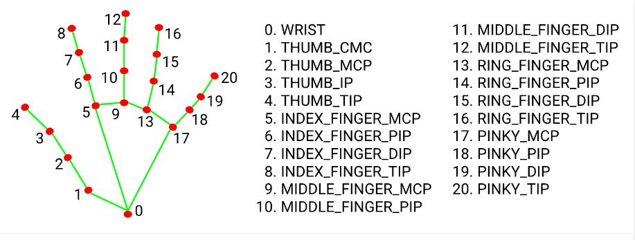
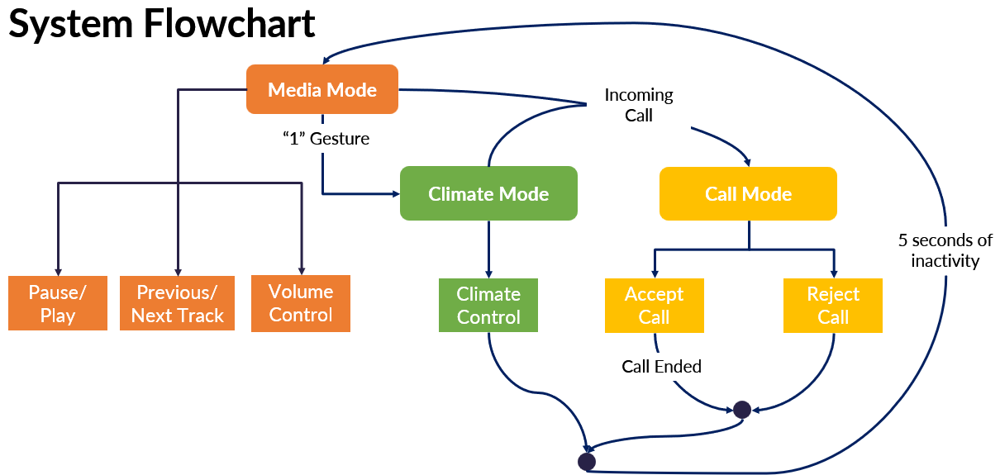

# Team Seoul
Group members: Rithwik Jayanth, Steven Shang Shi, Chris Suzuki, Leo Chen

24-678 Computer Vision for Engineers

Last Updated: December 9th 2022

# System Description

The purpose of this project is to create a hand gesture recognition library that is able to conduct a task once a hand gesture is recognized. The goal is to apply this to automobiles, where a driver’s hand gesture will trigger the activation/modification of a car feature (ex. turning on/off the wipers, changing the music track, etc.) to reduce distractiosn while driving. The design will also achieve gesture recongition in lower lighting conditions, simplify the gestures required to activate functions and improve the overall accuracy of the gesture recongnition.

# Hardware Design
The Design uses the Intel Realsense L515 for RGB, IR, and Depth Camera capabilties.
Requirements:
1. Preferable - Intel Realsense L515 Camera
    a. USB 3.0 Connection
3. ELP Camera - https://a.co/d/7y2CkFu

# Software Design

We use a MediaPipe and Tensor Flow package referred in the resource section to track hands and their finger positions like the image below:

Figure 1. Hands Package Results

Using the data from the fingertip positions we generated a gesture and hand sign library and mapped them to different car intrisic features:
The following are the features that can be changed within the vehicle with the current library:
1. Change Modes
2. Volume/Temp Change
3. Next/Previous Track
4. Pause/Play Media
5. Answer Incoming Calls

Figure 2. Flow Logic of the Code

# How to run our code
Run on python verison 3.9 with the following packages installed:
opencv, numpy, mediapipe, and hands package from the link in resources.
Open file main_updated_final.py and run with any of the hardware cameras.

How to activate each function:
1. Change Modes
    a. Media Mode - Nothing
    b. Climate Mode - Hold Index Finger up to hold the number 1 sign
    c. Phone Call Mode - Press C on your keyboard
2. Volume/Temp Change - 

# Results

The final demonstration video of each functions can be seen here: https://github.com/chrisuzuki62/Seoul/tree/main/video_demo

# Resources
Reference for hand tracking: https://google.github.io/mediapipe/solutions/hands.html
